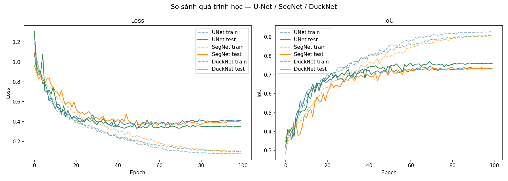
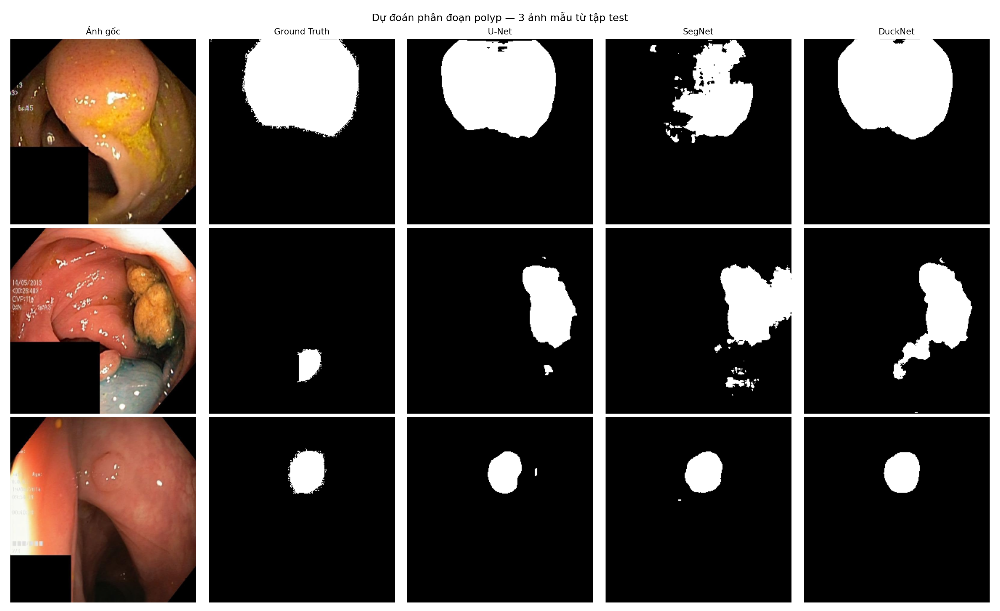

# Nghiên cứu và So sánh các Mô hình Học sâu trong Bài toán Phân đoạn Polyp Đại tràng

> **Đề tài Nghiên cứu Khoa học Sinh viên**
> Trường Đại học Ngoại ngữ – Tin học TP.HCM (HUFLIT)

---

## Giới thiệu đề tài

Polyp đại tràng là một trong những nguyên nhân hàng đầu dẫn đến ung thư đại trực tràng nếu không được phát hiện và điều trị kịp thời. Trong nội soi tiêu hóa, việc xác định chính xác vùng polyp đòi hỏi kinh nghiệm cao từ bác sĩ và dễ bị bỏ sót khi polyp nhỏ hoặc bằng phẳng.

Đề tài này ứng dụng **học sâu (Deep Learning)** để tự động phân đoạn vùng polyp từ ảnh nội soi đại tràng. Ba kiến trúc mạng nơ-ron tích chập được triển khai và so sánh:

| Mô hình | Vai trò | Đặc điểm |
|---------|---------|-----------|
| **U-Net** | Baseline | Skip connection, encoder–decoder cổ điển |
| **SegNet** | Baseline | Dùng lại max-pooling indices để upsample |
| **DuckNet** | Mô hình đề xuất | DUCK block đa tỉ lệ, Attention Gate, SE block |

Bộ dữ liệu sử dụng: **Kvasir-SEG** — 1.000 ảnh nội soi đại tràng có nhãn phân đoạn được thu thập và công bố bởi Simula Research Laboratory (Na Uy).

---

## Phương pháp

### Kiến trúc mô hình

- **U-Net**: mạng encoder–decoder với 4 tầng pooling, skip connection nối thẳng đặc trưng encoder sang decoder.
- **SegNet**: tương tự U-Net nhưng sử dụng lại chỉ số max-pooling thay vì skip connection trực tiếp.
- **DuckNet (đề xuất)**: mở rộng U-Net với DUCK block (kết hợp tích chập đa kernel 3×3, 5×5, 7×7), Squeeze-and-Excitation block, Attention Gate và residual connection.

### Hàm mất mát

Kết hợp BCE và Dice Loss:

```
Loss = BCEWithLogitsLoss + DiceLoss
```

Cách kết hợp này giải quyết bất cân bằng giữa vùng polyp (nhỏ) và nền (lớn).

### Các độ đo đánh giá

| Độ đo | Công thức |
|-------|-----------|
| Accuracy | (TP + TN) / (TP + TN + FP + FN) |
| Dice Score | 2·TP / (2·TP + FP + FN) |
| IoU (Jaccard) | TP / (TP + FP + FN) |
| Precision | TP / (TP + FP) |
| Recall | TP / (TP + FN) |
| F1-Score | 2·Precision·Recall / (Precision + Recall) |

### Chia dữ liệu

- Tập train: **700 ảnh (70%)**
- Tập test: **300 ảnh (30%)**
- Seed cố định `42` để đảm bảo tính tái lập và so sánh công bằng giữa 3 mô hình.

---

## Cài đặt và Chạy

### Yêu cầu hệ thống

- Python **3.10** trở lên
- GPU NVIDIA (khuyến nghị); CPU vẫn chạy được nhưng chậm hơn đáng kể

### Bước 1 — Tải dataset

Tải **Kvasir-SEG** tại: https://datasets.simula.no/kvasir-seg/

Đặt vào đúng cấu trúc:

```
data/
└── Kvasir-SEG/
    ├── images/   (1000 file .jpg)
    └── masks/    (1000 file .jpg, cùng tên với ảnh)
```

### Bước 2 — Tạo môi trường ảo

```powershell
python -m venv .venv
.\.venv\Scripts\Activate.ps1
```

Nếu PowerShell chặn script:

```powershell
Set-ExecutionPolicy -Scope Process -ExecutionPolicy Bypass
.\.venv\Scripts\Activate.ps1
```

### Bước 3 — Cài thư viện

```powershell
pip install --upgrade pip
pip install -r requirements.txt
```

### Bước 4 — Cài PyTorch có CUDA (nếu có GPU NVIDIA)

Mặc định `pip install torch` sẽ cài bản CPU-only. Để dùng GPU:

```powershell
pip uninstall torch torchvision torchaudio -y
pip install torch torchvision --index-url https://download.pytorch.org/whl/cu118
```

Kiểm tra:

```powershell
python -c "import torch; print(torch.cuda.is_available())"
# True → đã dùng GPU
```

### Bước 5 — Tải trọng số mô hình đã huấn luyện (tùy chọn)

Các file `.pth` không được lưu trong repo (quá nặng so với giới hạn của GitHub). Để chạy demo mà không cần huấn luyện lại, tải 3 file checkpoint tại mục [Releases](../../releases) và đặt vào thư mục `checkpoints/`:

```
checkpoints/
├── unet_fair_last.pth
├── segnet_fair_last.pth
└── ducknet_fair_last.pth
```

### Bước 6 — Huấn luyện

Mở notebook `trains/train_models.ipynb` và chạy từ trên xuống dưới:

- **Cell Setup**: load data, định nghĩa cấu hình chung
- **Cell 1–3**: lần lượt train U-Net → SegNet → DuckNet
- **Cell 4**: in bảng so sánh 6 độ đo
- **Cell 5**: vẽ biểu đồ Loss / IoU theo epoch
- **Cell 6**: trực quan hóa dự đoán trên ảnh mẫu

### Bước 7 — Chạy ứng dụng demo

```powershell
streamlit run app/app.py
```

Mở trình duyệt tại `http://localhost:8501`, tải ảnh nội soi lên và xem kết quả phân đoạn.

---

## Cấu trúc dự án

```
PolypSegmentation/
│
├── data/
│   └── Kvasir-SEG/
│       ├── images/
│       └── masks/
│
├── models/
│   ├── unet.py         — Kiến trúc U-Net
│   ├── segnet.py       — Kiến trúc SegNet
│   └── ducknet.py      — Kiến trúc DuckNet (đề xuất)
│
├── utils/
│   ├── dataset.py      — Load ảnh và mask từ thư mục
│   ├── transforms.py   — Augmentation (flip, resize, normalize)
│   ├── losses.py       — BCEDiceLoss
│   ├── metrics.py      — 6 độ đo đánh giá
│   ├── data.py         — PolypDataConfig, build_kvasir_dataloaders
│   ├── train.py        — PolypTrainConfig, vòng lặp training, evaluate_model
│   └── evaluation.py   — report_tuned_metrics (bảng kết quả đầy đủ)
│
├── trains/
│   └── train_models.ipynb  — Notebook huấn luyện và so sánh 3 mô hình
│
├── checkpoints/            — Lưu trọng số mô hình sau huấn luyện
│
├── app/
│   └── app.py              — Ứng dụng demo Streamlit
│
├── requirements.txt
└── README.md
```

---

## Kết quả thực nghiệm

*Bảng kết quả sẽ được cập nhật sau khi hoàn thành huấn luyện.*

| Mô hình | Accuracy | Dice | IoU | Precision | Recall | F1 |
|---------|----------|------|-----|-----------|--------|-----|
| U-Net | — | — | — | — | — | — |
| SegNet | — | — | — | — | — | — |
| DuckNet | — | — | — | — | — | — |

<p align="center">
  
</p>

<p align="center">
  
</p>

**Cấu hình huấn luyện (fair comparison):**
- Optimizer: AdamW, lr = 3×10⁻⁴, weight decay = 10⁻⁴
- Epochs: 100 (với 5 epoch warmup)
- Batch size: 4, Image size: 256×256
- Scheduler: Cosine Annealing

---

## Công nghệ sử dụng

- **PyTorch** — framework học sâu chính
- **Albumentations** — augmentation ảnh
- **OpenCV** — xử lý ảnh
- **Streamlit** — giao diện demo web
- **Matplotlib / Pandas** — trực quan hóa và bảng kết quả

---

## Tài liệu tham khảo

1. Ronneberger, O., Fischer, P., & Brox, T. (2015). **U-Net: Convolutional Networks for Biomedical Image Segmentation**. MICCAI 2015.
2. Badrinarayanan, V., Kendall, A., & Cipolla, R. (2017). **SegNet: A Deep Convolutional Encoder-Decoder Architecture for Image Segmentation**. IEEE TPAMI.
3. Dumitru, R. G., Peteleaza, D., & Craciun, C. (2023). **Using DUCK-Net for Polyp Image Segmentation**. Scientific Reports.
4. Jha, D., et al. (2020). **Kvasir-SEG: A Segmented Polyp Dataset**. MMM 2020.

---

## Giấy phép

Dự án được phát hành theo giấy phép [MIT](LICENSE).

---

*Đề tài NCKH — Trường Đại học Ngoại ngữ – Tin học TP.HCM (HUFLIT)*
